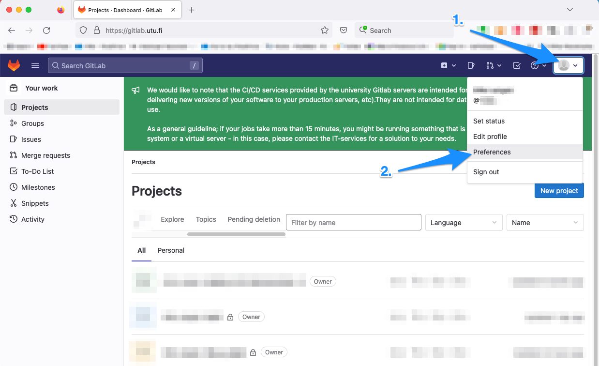

# Navigating GitLab

You should now be logged in to GitLab.

## Dashboard

In the opening screen, you will see your projects - either the ones you have created or to which you have been invited. If you don't have any projects yet, don't worry.

The opening screen will look something like this:

<br>


<br>
<br>

## SSH key setting

We will now have to give GitLab your SSH key in order to push or pull projects between your computer and GitLab.

Click on your avatar on the upper right corner of webpage and select ```Preferences```:

<br>


<br>
<br>

Then, click on ```SSH Keys```:

<br>


<br>
<br>


You will see a text box where you should paste your SSH key, which you probably don't have yet, but don't worry about it, it is easy to create one. The webpage will look something like this:

<br>


<br>
<br>

Do not input anything yet. You can leave the webpage as it is. On Mac, you would want to press ```Command``` + ```H```, which hides your internet browser. (On Windows, you may just click the minus-looking sign on the right corner of your web browser window.)

In the next chapter, we will create an SSH key.

<br> <br> <a rel="license" href="http://creativecommons.org/licenses/by-sa/4.0/"></a><br />[Lightning Fast Git Guide]{xmlns:dct="http://purl.org/dc/terms/" property="dct:title"} by <a xmlns:cc="http://creativecommons.org/ns#" href="https://vldesign.kapsi.fi/git-guide" property="cc:attributionName" rel="cc:attributionURL">Ville Langén</a> is licensed under a <a rel="license" href="http://creativecommons.org/licenses/by-sa/4.0/">Creative Commons Attribution-ShareAlike 4.0 International License</a>.
