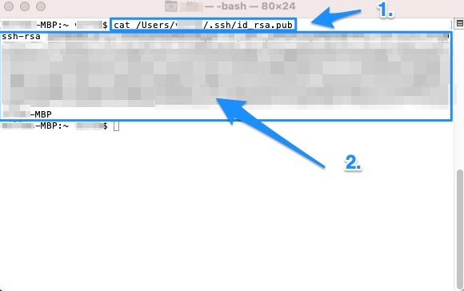

# Create an SSH key

## On Mac {#mac_section}

Open up the Terminal again. You can click on its icon on the dock (the "ribbon" that is in the bottom of your screen), or hold down `Command` and simultaneously press `Tab` until the Terminal is highlighted. You're suddenly back in Terminal.


Now, type the following command:

```         
ssh-keygen
```

The Terminal will read something like this:

```         
Generating public/private rsa key pair.
Enter file in which to save the key (/Users/YOU CAN SEE YOUR COMPUTER USER NAME HERE/.ssh/id_rsa):
```

It suggests you that file name and file location, and you can confirm that.

Next, it will ask whether you want to set a password - in this example, the data traffic will be between you and the code repository of University of Turku, and as such, I would not set any password here:

```         
Enter passphrase (empty for no passphrase):
```

After that, the Terminal will display where the SSH key has been saved:

<br>


<br> <br>

Now you can type in `cat /Users/YOUR COMPUTER USER NAME HERE/.ssh/id_rsa.pub`

and press enter. You will see your whole SSH key displayed in the Terminal window. Select it with your mouse and press `Command` + `C` - this will copy the SSH key to your computer's clipboard.

Pay attention to select the whole key, starting already from the words `ssh-rsa` all the way to the end, including even your computer type (in this example: `-MBP`).

In other words, select the whole block that you can see surrounded by the blue box here below:

<br>



<br>
<br>

## On Windows

The process is very similar to what you saw [above on the Mac section](#mac_section). Just use the Git Bash for these commands.

Your relevant code might look something like this:

```
cat /c/Users/YOUR COMPUTER USER NAME HERE/.ssh/id_rsa.pub
```

Adjust the code to your needs. If you can't get it work, there are good tutorials for getting Git to run and creating the SSH key on YouTube. You may e.g. type in the YouTube search field:

```Setup Git and SSH for GitLab on Windows```

and you'll find good tutorials and get these things to work, eventually.

<br>
<br>

In the next chapter, we will paste your SSH key to GitLab's respective SSH key field.

<br> <br> <a rel="license" href="http://creativecommons.org/licenses/by-sa/4.0/"></a><br />[Lightning Fast Git Guide]{xmlns:dct="http://purl.org/dc/terms/" property="dct:title"} by <a xmlns:cc="http://creativecommons.org/ns#" href="https://vldesign.kapsi.fi/git-guide" property="cc:attributionName" rel="cc:attributionURL">Ville Langén</a> is licensed under a <a rel="license" href="http://creativecommons.org/licenses/by-sa/4.0/">Creative Commons Attribution-ShareAlike 4.0 International License</a>.
