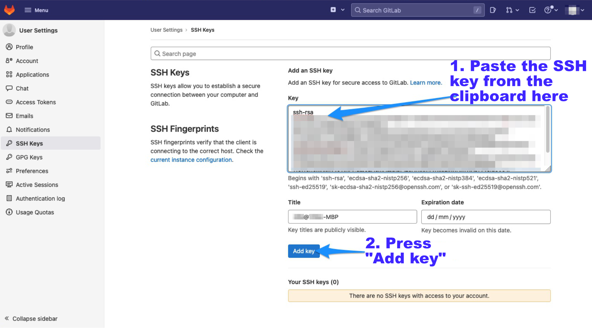

# SSH key to GitLab

Open up your web browser once again. If you didn't leave the GitLab page, you should still see SSH key field, where you can now paste your SSH key from your clipboard:

 

 
 

You should be all set now.

In the next chapter, we will clone your GitLab project to your computer with RStudio.

     [Lightning Fast Git Guide]{xmlns:dct="http://purl.org/dc/terms/" property="dct:title"} by <a xmlns:cc="http://creativecommons.org/ns#" href="https://vldesign.kapsi.fi/git-guide" property="cc:attributionName" rel="cc:attributionURL">Ville Langén</a> is licensed under a <a rel="license" href="http://creativecommons.org/licenses/by-sa/4.0/">Creative Commons Attribution-ShareAlike 4.0 International License</a>.
