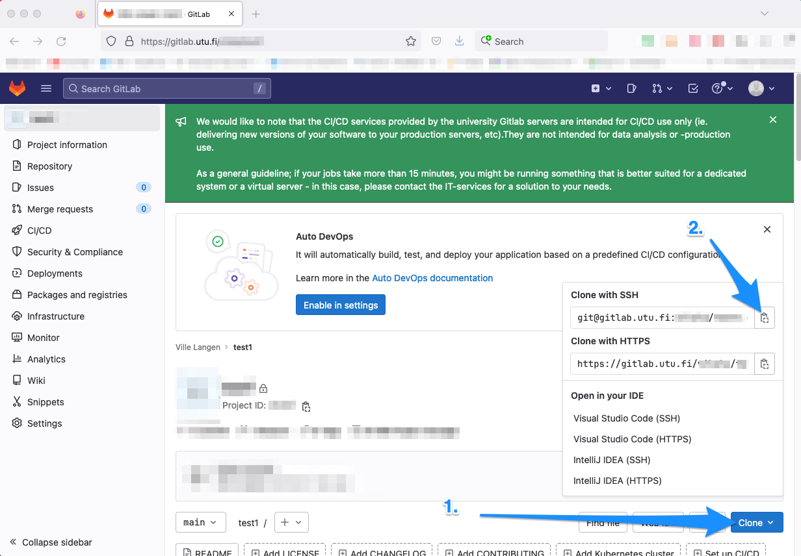
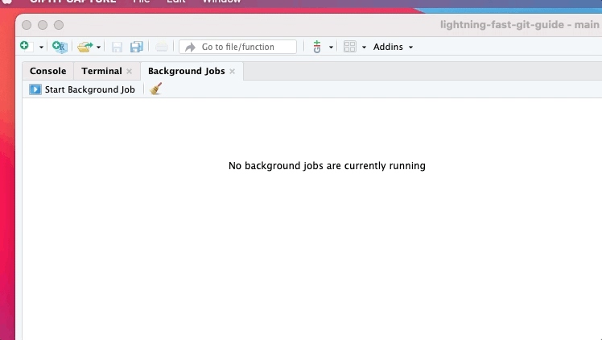
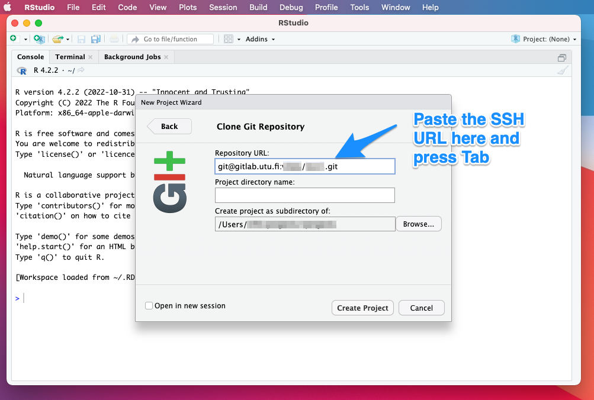
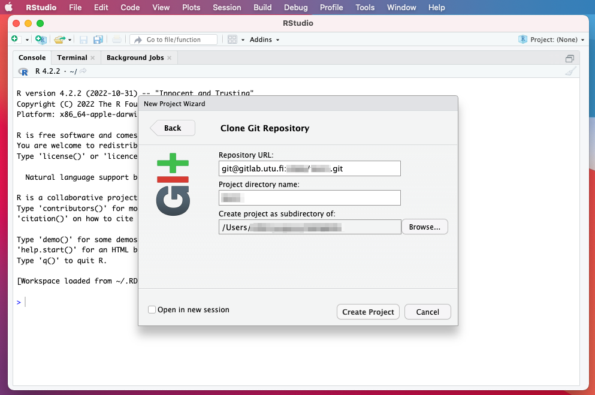
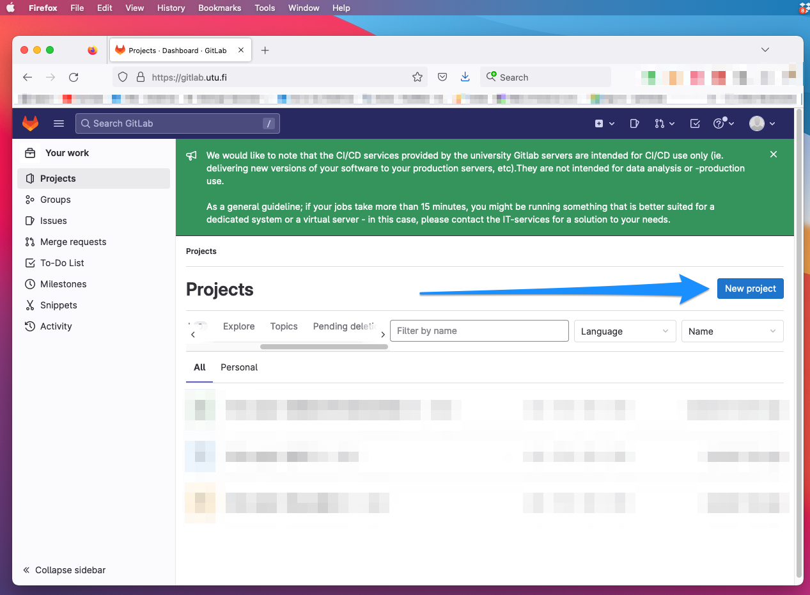
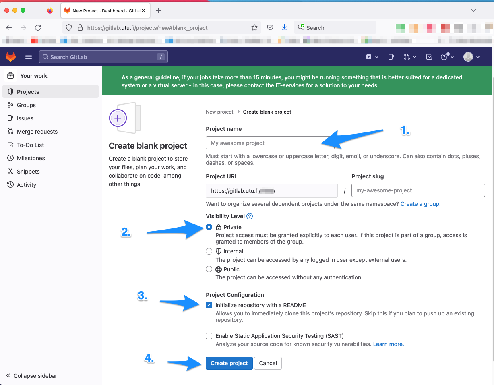
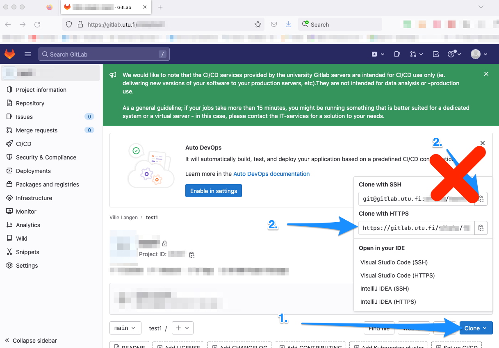

# Cloning a repository {#existing_repository}

## Definition

I will demonstrate how you can clone a repository using RStudio. Cloning copies your entire GitLab project, with all files, subfolders and even version history, to your computer. Cloning is a bit like pulling (you will learn this term later), but here we pull the entire repository to your computer at once, not just the changes other people have made to your project.

Actually, it doesn't even matter, if you will process your content subsequently with RStudio or R at all. RStudio can just be used as a cloning/pushing/pulling workstation of your GitLab project.

You don't have to know the R programming language at all. You don't really have to have any knowledge on the RStudio software either.

However, if you are interested in these matters, you may want to look at a separate guide I have written on that topic:

https://vldesign.kapsi.fi/r-guide-in-english/ (in English)

https://vldesign.kapsi.fi/r/ (in Finnish)

## Existing repository

If you have already been invited to collaborate on a project in GitLab, the workflow goes as follows:

-   Click on the upper left corner, where you see an icon resembling a fox
    -   That will take you back to your dashboard
-   Click on a project where you have been invited

Next, click on:

1.  `Clone`, and subsequently, on
2.  `Copy URL` under the `Clone with SSH`

See the image below for details on where to click:

 

 
 

## Clone to RStudio

Launch RStudio. Click File --\> New Project --\> Version Control --\> Git

 

 
 

Press `Command` + `V`, this will paste the SSH URL:

 

 
 

Thereafter, press `Tab`. The screen will look something like here:

 

 
 

Now, change the folder to whatever you like. It could be, e.g.,

`/Users/YOUR COMPUTER USER NAME HERE/rprojects`

Note that RStudio will automatically make a subfolder with the displayed project directory name.

And boom, there you have it. You have just cloned the remote repo from GitLab to your computer.

## New repository

If you haven't been invited yet to any GitLab projects, you can make your own repository right away. You can delete if afterwards, if you want.

The workflow goes as follows:

-   Click on the upper left corner, where you see an icon resembling a fox
    -   That will take you back to your dashboard
-   Click on `New project`

 

 
 

Next, click on "Create blank project".

Next, you will see the following screen. Give your project a name, keep it private this time, you may create a README.md file automatically and finally, click on `Create project`:

 

 
 

You can now proceed as if you had been invited to a GitLab project, please see the instructions [above](#existing_repository)

If you can't make it work, try inserting the HTTPS URL from the GitLab to RStudio:

 

 
 

In the next chapter, we will practice pushing to a remote repo (here: to GitLab).

     [Lightning Fast Git Guide]{xmlns:dct="http://purl.org/dc/terms/" property="dct:title"} by <a xmlns:cc="http://creativecommons.org/ns#" href="https://vldesign.kapsi.fi/git-guide" property="cc:attributionName" rel="cc:attributionURL">Ville Langén</a> is licensed under a <a rel="license" href="http://creativecommons.org/licenses/by-sa/4.0/">Creative Commons Attribution-ShareAlike 4.0 International License</a>.
