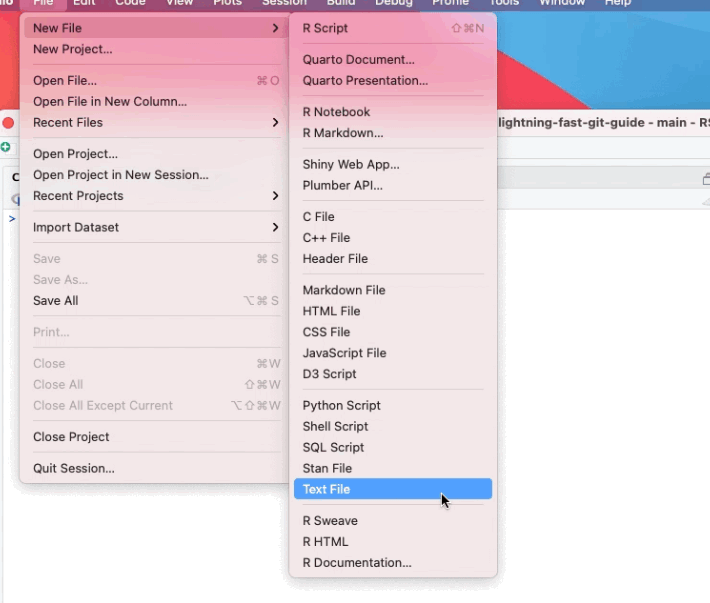
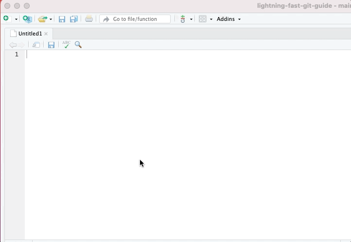
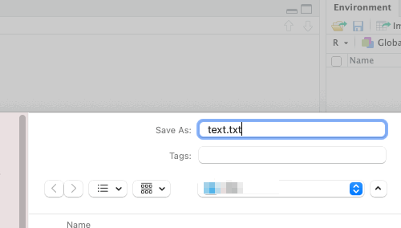
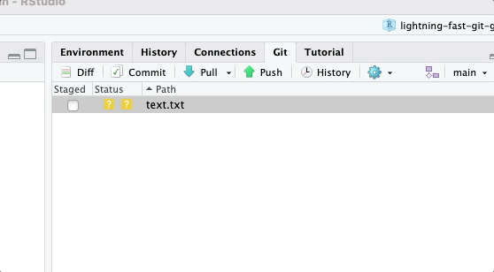
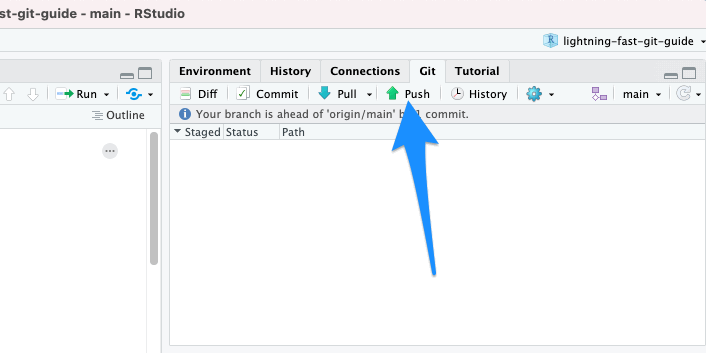

# Pushing to GitLab

## Definition

Pushing means that you upload your version of your project to the remote repository (here: to GitLab).

## Pushing with RStudio

In RStudio, do the following things:

1.  Create a new text file
2.  Write some text on it
3.  Save it
4.  Commit it to the repository
    -   This means "staging it", which is a thing you have to do before pushing
    -   You also write a little message, at this time, to what you are committing/pushing
5.  Push it to GitLab

All of these steps are depicted below:

In the next chapter, we will practice how to pull files from a remote repo (here: from GitLab).

     [Lightning Fast Git Guide]{xmlns:dct="http://purl.org/dc/terms/" property="dct:title"} by <a xmlns:cc="http://creativecommons.org/ns#" href="https://vldesign.kapsi.fi/git-guide" property="cc:attributionName" rel="cc:attributionURL">Ville Langén</a> is licensed under a <a rel="license" href="http://creativecommons.org/licenses/by-sa/4.0/">Creative Commons Attribution-ShareAlike 4.0 International License</a>.
