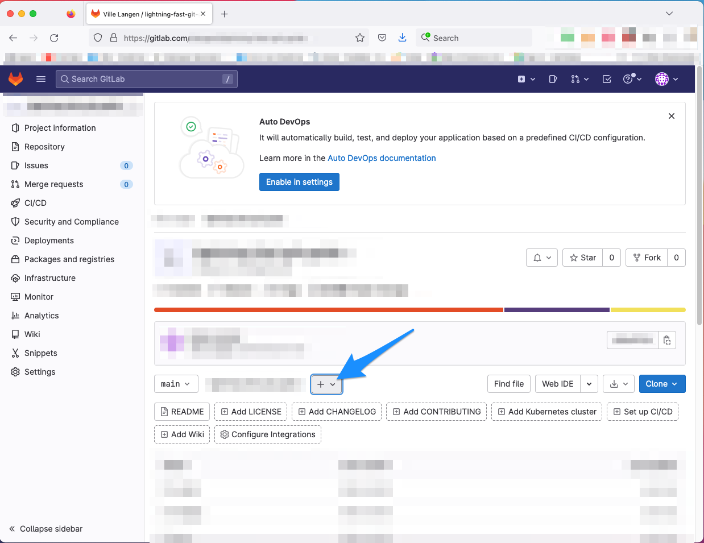
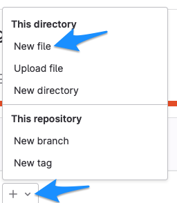
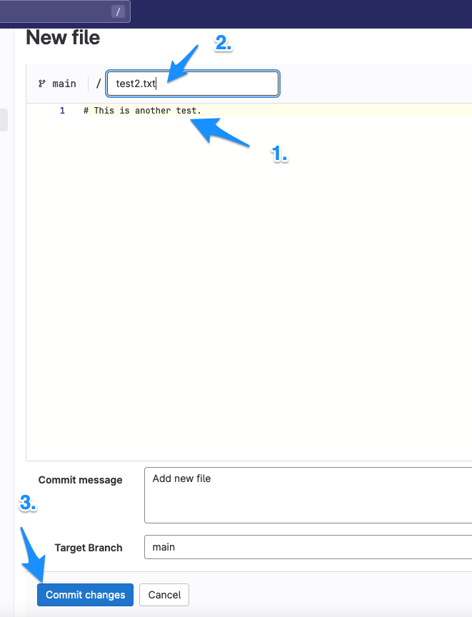
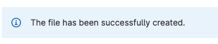
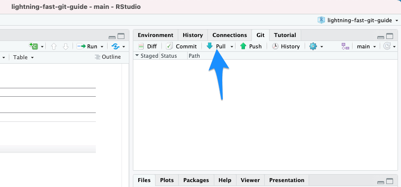

# Pulling from GitLab

## Definition

Pulling is a bit like the opposite of pushing. When you pull, you download the changes that your coworkers have done and pushed to the remote repository (here: GitLab). The changes are merged with your local project files.

## Pulling with RStudio

Pulling is even easier than pushing in RStudio.

Let's pretend for a few minutes that you are one of your coworkers and you have created some new content and pushed it to GitLab. Alternatively, this coworker might be creating the content straight in the remote repository (here: in GitLab) via the web browser, without any pushing.

To simulate this, in GitLab, do the following things:

1.  Go back to your project
2.  Click the `+` symbol
3.  Click `New file`\
4.  Write some stuff (anything)
5.  Give your file a name
6.  Click on `Commit changes`

All of these steps are depicted below:

 

 
 

 
 

 
 

 
 

Now, you are back to being you and you want to pull the changes made in the remote repository to your computer.

Back in RStudio, just click on `Pull`.

 

 
 

And boom, the file is on your computer.

     [Lightning Fast Git Guide]{xmlns:dct="http://purl.org/dc/terms/" property="dct:title"} by <a xmlns:cc="http://creativecommons.org/ns#" href="https://vldesign.kapsi.fi/git-guide" property="cc:attributionName" rel="cc:attributionURL">Ville Langén</a> is licensed under a <a rel="license" href="http://creativecommons.org/licenses/by-sa/4.0/">Creative Commons Attribution-ShareAlike 4.0 International License</a>.
